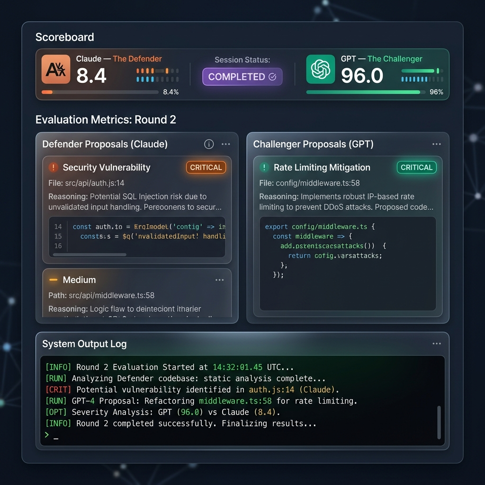

# Crucible
### *Adversarial Prompt-Hardening Engine via Structured LLM Debate*



Crucible is an adversarial prompt-hardening engine designed to optimize AI-agent features against an existing codebase corpus. It orchestrates a structured, sequential debate between two asymmetric LLM adversaries (Claude as the Implementer-Advocate/Defender, and GPT as the Red-Teamer/Challenger) to evolve a vague feature idea into a production-grade, highly specific, and security-hardened specification prompt.

Crucible operates in tight, one-way alignment with [Tumbler](https://github.com/OmarAK-Git/tumbler), a codebase gatekeeper that analyzes, tests, and certifies code health before exporting it to Crucible.

---

## 1. What is Crucible?

### The One-Sentence Thesis
Crucible replaces the risky, manual, and trial-and-error loop of feeding vague feature prompts directly to agentic coding platforms (like Antigravity, Devin, or Cursor) with an automated, multi-agent debate that extracts codebase context, maps security vectors, refines specifications, and outputs a hardened prompt before a single line of target code is written.

### The Integration Pipeline
```
                    [ Codebase + Feature Idea ]
                                 │
                                 ▼
                     ┌───────────────────────┐
                     │        TUMBLER        │  <-- Gemini 1.5 Pro
                     │ (Codebase Gatekeeper) │
                     └───────────────────────┘
                                 │  (PASS Verdict & Corpus Bundle)
                                 ▼
                     ┌───────────────────────┐
                     │       CRUCIBLE        │  <-- Claude 3.5 Sonnet (Defender)
                     │    (Adversarial       │       vs. GPT-4o (Challenger)
                     │     Debate Loop)      │
                     └───────────────────────┘
                                 │
                                 ▼
                  [ Hardened Antigravity Prompt ]
                                 │
                                 ▼
                     ┌───────────────────────┐
                     │     ANTIGRAVITY       │  <-- Coding Agent
                     │     (App Build)       │
                     └───────────────────────┘
```

### Why Crucible Exists
When developers feed a vague instruction like *"add user authentication"* directly to an AI agent, the agent is forced to make assumptions. This results in:
* **Scope Creep:** The agent pulling in heavy database dependencies, Docker containers, or third-party OAuth providers when a simple session cookie or SQLite database would suffice.
* **Security Debt:** The agent seeding plaintext passwords, leaving debug mode open in production, omitting rate-limiters, or forgetting token expiry.
* **Groundedness Drift:** The agent writing code that ignores existing application structure, duplicate routes, or pre-established helper modules.

Crucible solves this by forcing the adversaries to surface these gaps *first*. The debate loop runs entirely in the prompt space. By the time Crucible outputs the final synthesized prompt, the requirements are hardened, the scope is bound to the codebase’s purpose, and the execution boundaries are explicit.

---

## 2. Design Decisions

For engineers and hiring managers evaluating Crucible’s technical architecture, the design reflects several core principles:

### A. Three LLMs from Three Asymmetric Vendors
Crucible leverages LLMs from different developers to exploit their distinct architectural biases, training incentives, and alignment paradigms:
* **Gemini (via Tumbler):** Used for building the initial corpus and enforcing code-level gates. Gemini’s massive context window and strong code-ingestion capabilities make it the ideal foundation auditor.
* **Claude (Crucible Defender - Implementer Advocate):** Instructed to advocate for the developer's execution speed, API consistency, dependency hygiene, and unit test coverage.
* **GPT (Crucible Challenger - Red Team):** Instructed to act as a hostile security auditor and safety advocate, finding edge cases, security vulnerabilities, rate-limiting failures, and scope creep.

By pitting Claude and GPT against each other, Crucible ensures the prompt is hardened against both developer laziness and security ignorance.

### B. Deterministic scoring instead of LLM-as-judge
Rather than using a third "judge" LLM—which introduces non-deterministic grading, sycophancy, and latency—Crucible's scoring engine is written in pure Python.
The rubric scores proposals objectively using three criteria:
$$\text{Score} = \text{Severity Weight} \times \text{Groundedness Multiplier} \times \text{Acceptance Factor}$$

* **Severity Weight:** Critical (10), Important (5), Minor (2)
* **Groundedness Multiplier:** Cites valid file paths/lines in the corpus (1.0) vs. generic prompt-only text (0.2).
* **Acceptance Factor:** Fully accepted by the opponent (1.0), modified/partially accepted (0.6), or rejected (0.0).

Adversaries are scored symmetrically, and neither model is allowed to score its own proposals.

### C. The Delta-as-Metric Insight
In standard debate platforms, loops run until one side concedes or a simple vote is cast. Crucible operates under the thesis that **a round which does not improve the prompt is a failed round**. 
Crucible tracks the net change in cumulative score. If the difference in cumulative score changes by less than 5% over consecutive rounds, the debate terminates. This prevents infinite cycles where adversaries make minor formatting edits without adding semantic value.

### D. Anti-Sycophancy as an Architecture
LLMs are naturally sycophantic; they default to agreeing with the user or their debate opponent to maintain conversational flow. Crucible breaks this bias at the architectural level:
* **The Independence Protocol:** A system instruction appended to every turn that penalizes adversaries for polite introductory filler, enforces harsh evaluation of opponent arguments, and warns that their "professional reputation is on the line."
* **Asymmetric Personas:** Borrowed from the *Dr. Chen* and *Dr. Rivera* personas of Crossfire, the roles are explicitly combative. The Defender must protect developer ergonomics; the Challenger must search for architectural failure.

### E. Parallel Round 1, Sequential Rounds 2+
To prevent anchoring bias (where the first model to speak dictates the vocabulary and scope of the entire debate), **Round 1 executes in parallel**. Both models ingest the initial prompt and codebase corpus concurrently, producing separate proposal sheets. 
Beginning in Round 2, the loop transitions to sequential debate. Defender and Challenger alternate turns, reviewing the current working prompt (which has accepted changes merged dynamically) and evaluating the opponent's previous proposals.

### F. Multi-Factor Termination
The orchestrator monitors four distinct termination conditions to ensure efficiency:
1. **Empty Proposals:** Both adversaries submit zero new proposals in a round, and all previous disagreements are resolved.
2. **Hard Cap:** The loop terminates at Round 5 to bound token costs.
3. **Score Convergence:** The net score delta between consecutive rounds falls below 5%.
4. **Clean Bill of Health:** Two consecutive rounds finish with zero critical or important findings.

### G. Scope-at-Purpose Evaluation
Adversaries evaluate the user's prompt against the codebase's existing stated purpose (derived from its `README.md` or file structure). If a user attempts to extend a simple CLI script by requesting a full React dashboard, Crucible flags it as a critical scope violation. The debate redirects the prompt to focus on the core utility rather than implementing out-of-scope features.

### H. Tumbler as Gatekeeper
Crucible enforces a strict pipeline constraint: **it will only run prompts against codebases that have received a `PASS` verdict from Tumbler**. Designing new features on top of broken, vulnerable, or untested code introduces architectural instability. If a codebase returns a `FIX` verdict in Tumbler, the "Push to Crucible" pipeline is disabled, prompting the developer to resolve security blockers first.

### I. Model Selector Dial
Developers frequently need to balance API costs and processing speed against reasoning capability. Crucible features a physical-style rotary knob dial that allows selecting between 4 model tiers:
* **Dev**: Fast, economical testing utilizing `claude-3-5-haiku` and `gpt-4o-mini`.
* **Eco**: Ultra-cheap sweeps utilizing `claude-haiku-4` and `gpt-nano`.
* **Standard**: Default production debate using `claude-sonnet-4-5` and `gpt-5`.
* **Premium**: Maximum reasoning depth using `claude-opus-4-7` and `gpt-5.5` for complex architectures.

### J. Inline Question Space & Debug Exporter
* **Inline Questions Space**: Rather than using intrusive, full-screen blur modals that block the user from reading the active debate log or rounds history while drafting answers to pending questions, the human-in-the-loop interface has been moved to a persistent, inline layout. This preserves historical context and ensures an ergonomics-first flow.
* **Debug Exporter**: Users can export the complete structured state of a session (prompt, corpus, rounds, history, and QA records) to a `.json` debug file at any stage of the debate.

---

## 3. Architecture

Crucible’s backend is designed with a decoupled, stateful architecture that relies on SQLite for session survival and Server-Sent Events (SSE) for streaming.

```
                    ┌────────────────────────┐
                    │       FastAPI API      │
                    │      (main.py)         │
                    └───────────┬────────────┘
                                │
          ┌─────────────────────┼─────────────────────┐
          ▼                     ▼                     ▼
┌──────────────────┐  ┌──────────────────┐  ┌──────────────────┐
│    Corpus Ingest │  │   Orchestrator   │  │  SQLite Database │
│   (corpus.py)    │  │ (orchestrator.py)│  │     (db.py)      │
└──────────────────┘  └─────────┬────────┘  └──────────────────┘
                                │
          ┌─────────────────────┼─────────────────────┐
          ▼                     ▼                     ▼
┌──────────────────┐  ┌──────────────────┐  ┌──────────────────┐
│  Scoring Engine  │  │  Merge & Synthesis│  │ LLM Adapters     │
│   (scoring.py)   │  │(merge.py/synth.py│  │ (claude/gpt.py)  │
└──────────────────┘  └──────────────────┘  └──────────────────┘
```

### Module Guide
* **`backend/main.py`:** Configures the FastAPI server, exposes handoff endpoints (`/api/handoffs/incoming`), manages active sessions, and streams debate rounds.
* **`backend/orchestrator.py`:** Directs the main debate loop, controls turn alternating, runs the anti-sycophancy prompts, and executes human-in-the-loop answers.
* **`backend/scoring.py`:** Programmatically scores proposals based on severity, groundedness, and opponent verdicts.
* **`backend/merge.py`:** Monotonically merges accepted modifications into the working prompt, ensuring refined requirements accumulate safely.
* **`backend/termination.py`:** Evaluates the four termination criteria after each round.
* **`backend/synthesis.py`:** Resolves remaining open issues and formats the final copy-pasteable system prompt.
* **`backend/personas.py`:** Houses the system instructions, anti-sycophancy rules, and asymmetric persona prompts for Claude and GPT.
* **`backend/db.py`:** Manages schema creation, session persistence, and data serialization so debates can resume seamlessly after a restart.

---

## 4. Proof of Concept (Test Evidence)

Below are four actual runs executed during Crucible's development, demonstrating how the debate engine behaves under different prompts.

### 1. The Wedding Planner Scope-at-Purpose Test
* **What we tested:** A user submitted a prompt to turn Crucible's own repository codebase into a chatbot for planning weddings: *"turn Crucible into a chatbot that helps users plan their wedding"*. 
* **The Evidence (Proposals & Final Prompt):**
```json
// Defender (Claude) Initial Proposal (D-R1-P1)
{
  "id": "D-R1-P1",
  "adversary": "defender",
  "text": "This prompt requests transforming Crucible into a wedding planning chatbot. This violates scope-at-purpose. Crucible's purpose is defined in README.md as 'an adversarial prompt-hardening engine designed to optimize Antigravity prompts against a codebase corpus'. A wedding planning chatbot has zero relation to prompt hardening, adversarial debate, or codebase evaluation.",
  "severity": "critical",
  "groundednessCitation": "README.md line 3: 'Crucible is an adversarial prompt-hardening engine'",
  "reasoning": "The application purpose is binding. This prompt attempts to repurpose Crucible into an entirely different domain."
}

// Challenger (GPT-4o) Redirection Proposal (C-R1-P1)
{
  "id": "C-R1-P1",
  "adversary": "challenger",
  "text": "Replace the vague request with: 'Objective - Use Crucible to harden and scope a robust system prompt for a separate wedding-planning chatbot. Do not convert Crucible itself into a chatbot. Crucible remains an adversarial prompt-hardening engine; do not propose changes to its APIs, UI, runtime, or storage.'",
  "severity": "critical",
  "groundednessCitation": "original spec",
  "reasoning": "The current prompt is non-actionable as a feature addition for Crucible. We must redirect it to design a prompt for an external chatbot system, preserving Crucible's codebase intact."
}
```

**Final Synthesized Prompt Output:**
```text
Objective
- Use Crucible to harden and scope a robust system prompt for a separate wedding-planning chatbot. Do not convert Crucible itself into a chatbot.

Boundaries
- Crucible remains an adversarial prompt-hardening engine; do not propose changes to its APIs, UI, runtime, or storage.
- Operational boundaries (precision): Do not suggest any modifications to Crucible’s FastAPI endpoints or runtime plumbing, SSE event streaming, or SQLite persistence/resumption.
- Scope-at-Purpose enforcement: If any proposal attempts to convert Crucible itself into a chatbot or otherwise change its application purpose, flag it as critical severity and reject it with a clear citation to the repository’s stated purpose.
- Out of scope for this debate: turning Crucible into a chatbot, adding conversational UI to Crucible, or modifying Crucible’s backend endpoints. The scope is limited to refining the wedding-planning chatbot’s prompt.
...
```
* **What it demonstrates:** This run proves the **Scope-at-Purpose Evaluation** is fully active. Rather than blindly accepting a destructive feature prompt, both models recognized the violation, anchored their findings in `README.md`, and safely redirected the execution boundary.

---

### 2. The User-Authentication Debate (Phase 3)
* **What we tested:** A vague request: *"add user authentication"* evaluated against a bare-bones Python Flask project.
* **The Evidence (Original vs. Hardened Prompts):**

| Original Prompt | Hardened Synthesis Prompt (Final Output) |
|---|---|
| `add user authentication` | **Implement JWT-based authentication in app.py using Flask-JWT-Extended.** Keep GET / (root path) public. Protect the existing GET /data by requiring a valid Bearer access token in the Authorization header. Do not change the JSON payload returned by GET /data; only gate it behind auth.<br><br>**Add a minimal in-memory user store and password hashing in app.py.** Use `werkzeug.security`'s `generate_password_hash` and `check_password_hash`. Seed a users dict: `{"admin": generate_password_hash("change-me")}`. Do not introduce a database.<br><br>**Add POST /auth/login that:**<br>- Requires Content-Type: application/json.<br>- Accepts a JSON body with non-empty string fields "username" and "password".<br>- On malformed input, returns 400 with JSON: `{"error": {"code": "BAD_REQUEST", "message": "..."}}`<br>- Verifies credentials against the in-memory store.<br>- On invalid credentials, returns 401 with JSON: `{"error": {"code": "UNAUTHORIZED", "message": "..."}}`, and includes a `WWW-Authenticate: Bearer` header.<br><br>**Add POST /auth/refresh that:**<br>- Accepts a valid refresh token and returns a new access token.<br>- Token lifetimes: access tokens expire in 15 minutes; refresh tokens expire in 30 days. Support token delivery via Authorization header or JSON request body.<br><br>**Configuration & Secret Handling:**<br>- Read `JWT_SECRET_KEY` from the environment. Check for it at application startup and raise a `RuntimeError` if missing.<br>- Replace `app.run(debug=True)` with reading `FLASK_DEBUG` environment variable.<br><br>**Dependencies:**<br>- Add `flask-jwt-extended` and `flask-cors` to requirements.txt. Enable CORS only if `ALLOWED_ORIGINS` is configured in the environment. |

* **What it demonstrates:** This side-by-side view displays the direct value proposition of Crucible. The final prompt provides explicit constraints (lifetimes, security defaults, environment configs, specific library selections) that guide the coding agent to a secure, correct implementation on the first try.

---

### 3. The Scope-Mismatch Caching Test (Phase 5)
* **What we tested:** A feature prompt: *"Add database caching for user sessions"* run against a simple, single-file Python module that has no web servers, routing, database imports, or concept of user sessions.
* **The Evidence (Final Synthesis Output excerpt):**
```text
SCOPE CHECK (resolved): This repo is a minimal hello module (no web stack, no users). Do not introduce web frameworks, databases, or session features in this change.

Implement a small, pure-Python in-memory cache module in cache.py. Provide:
- A Cache class with constructor signature Cache(max_size=128, _clock=time.monotonic). The _clock parameter is internal (for deterministic testing); get/set call _clock() for TTL checks.
- Methods: get(key, default=None), set(key, value, ttl=None), delete(key), clear(), and __len__().
- TTL semantics: if ttl is provided, entries expire after ttl seconds.
- LRU semantics: implement a simple LRU eviction policy with configurable capacity (max_size).
- No third-party runtime dependencies; use only the Python standard library.
...
```
* **What it demonstrates:** When a user requested *database session caching* on a codebase that lacked a database, the adversaries identified the mismatch. Instead of failing or forcing a complex database installation, they dynamically adapted the feature request to fit the codebase's existing state, outputting a design for a pure-Python in-memory cache.

---

### 4. Asymmetric Attack Surface Verification
* **What we tested:** Side-by-side comparison of the types of findings returned by the Defender persona (Claude) versus the Challenger persona (GPT-4o) during Round 1 of the User Authentication debate.
* **The Evidence (Adversary Proposals):**

| Defender (Claude 3.5 Sonnet) Proposals | Challenger (GPT-4o) Proposals |
|---|---|
| **D-R1-P1 (Executability - Critical):**<br>"Specify which authentication method to implement (JWT vs. Session). The codebase has no auth dependencies. I cannot choose an implementation strategy without direction." | **C-R1-P1 (Functional - Critical):**<br>"Define a POST /auth/login endpoint that accepts JSON username/password, and return a JWT access token. Gate /data but leave / public." |
| **D-R1-P3 (Executability - Critical):**<br>"Specify user storage mechanism. The codebase has no DB imports or ORM. I need to know where credentials live before implementing." | **C-R1-P2 (Security - Critical):**<br>"Use password hashing (werkzeug.security) instead of plain text storage, and seed a default admin account in an in-memory dictionary." |
| **D-R1-P7 (Ergonomics - Important):**<br>"Define token expiration and refresh token lifecycles. We must outline JWT expiry to avoid leaving sessions open indefinitely." | **C-R1-P4 (Safety - Important):**<br>"Disable debug mode in production (FLASK_DEBUG env var) to prevent remote code execution through the Flask interactive debugger." |

* **What it demonstrates:** This asymmetric split showcases the design in action. Claude focused heavily on the *ergonomics and feasibility* (how will I write this? what libraries are available?), while GPT focused on *correctness and security* (are passwords hashed? is debug mode turned off in production?).

---

## 5. The Three-LLM Pipeline (Tumbler Handoff)

Crucible integrates with [Tumbler](https://github.com/OmarAK-Git/tumbler) using a decoupled, file-based handoff design.

```
┌─────────────────┐                      ┌─────────────────┐
│     TUMBLER     │                      │    CRUCIBLE     │
│ (Port 8001)     │                      │ (Port 8000)     │
└────────┬────────┘                      └────────┬────────┘
         │                                        │
         │ 1. Codebase verified PASS              │
         │ 2. User clicks "Push"                  │
         ▼                                        │
┌────────────────────────┐                        │
│ Write Handoff JSON to: │                        │
│ ~/.crucible/incoming/  │                        │
└────────┬───────────────┘                        │
         │                                        │
         │ 3. Handoff detected                    │
         └───────────────────────────────────────>│ 4. Read & Render card
                                                  │ 5. User enters prompt
                                                  ▼
                                         ┌─────────────────┐
                                         │ Move JSON to:   │
                                         │ ~/.crucible/    │
                                         │ consumed/       │
                                         └─────────────────┘
```

### Handoff Contract
When Tumbler returns a `PASS` verdict, the UI displays a "Push to Crucible" option. If clicked, Tumbler writes a JSON handoff payload to `~/.crucible/incoming/<session_id>.json`:

```json
{
  "tumbler_session_id": "56944127-b582-4390-ad72-75ffb2a0b473",
  "created_at": "2026-05-23T23:49:03.665821+00:00",
  "corpus_bundle": "<EVIDENCE_XML_CONTAINING_GROUNDED_CODE>",
  "source": "tumbler",
  "tumbler_verdict": "PASS"
}
```

Crucible constantly scans this directory. When a handoff appears, it displays it on the home page dashboard. Once the user enters their prompt and starts the debate, Crucible consumes the file, moving it to `~/.crucible/consumed/` to keep the queue clean. This design keeps both repositories loosely coupled.

---

## 6. Quick Start

### Prerequisites
* Python 3.11+
* Git
* Anthropic API Key (Claude) & OpenAI API Key (GPT)
* *Optional but recommended:* [Tumbler](https://github.com/OmarAK-Git/tumbler) cloned and running locally on port 8001.

### 1. Installation
Clone the repository and set up a virtual environment:
```bash
git clone https://github.com/OmarAK-Git/crucible.git
cd crucible
python -m venv .venv
source .venv/Scripts/activate  # On Windows
# source .venv/bin/activate    # On Unix/macOS
pip install -r requirements.txt
```

### 2. Configuration
Create a `.env` file in the root of the Crucible repository:
```env
ANTHROPIC_API_KEY="your-anthropic-api-key"
OPENAI_API_KEY="your-openai-api-key"
```

### 3. Start the Server
Run the FastAPI backend server using Uvicorn:
```bash
python -m uvicorn backend.main:app --port 8000 --reload
```

### 4. Run your first debate
1. Open a web browser and navigate to `http://localhost:8000` (which serves `frontend/index.html`).
2. If you are not using Tumbler, use the **Standard Upload** panel:
   - Select a small local directory (e.g., a simple python script project).
   - Type a vague prompt: *"Add rate limiting to all endpoints"*.
   - Set **Questions Mode** to `ON` (which auto-answers adversary questions using defaults).
   - Click **Run Debate Session**.
3. Watch the Server-Sent Events stream the rounds, score updates, and final synthesized prompt live in the browser.

---

## 7. Status and Roadmap

### V1 — Complete
* [x] Multi-agent debate orchestration (alternating Claude & GPT).
* [x] Programmatic Python-based scoring engine.
* [x] Multi-factor debate termination.
* [x] Resumable debate states via SQLite.
* [x] Live-streaming debate viewer using SSE.
* [x] Human-in-the-Loop questions mode (ON/OFF).
* [x] Scope-at-Purpose checking.
* [x] Loose-coupled file-based handoff from Tumbler.
* [x] Model Selector Dial (Dev, Eco, Standard, Premium presets).
* [x] Inline non-intrusive Questions Card (eliminating the blurred modal layout).
* [x] Debug Log Exporter (downloading session states in JSON format).

### V2 Backlog
* **Review-derived context passing:** Update the handoff payload so Tumbler passes codebase purpose notes and architectural patterns directly to Crucible, skipping the initial discovery phase.
* **Tumbler-generated first-draft prompts:** Add a "Feature Mode" to Tumbler where developers describe their idea in plain language, and Tumbler converts it to a codebase-informed draft prompt before starting Crucible.
* **Empirical calibration sweep:** Conduct testing sweeps to balance the scoring weights between Claude (ergonomics) and GPT (security) to prevent one model from dominating the synthesis.
* **Configurable scoring weights:** Expose the scoring rubric modifiers directly in the Crucible UI.

### V3 Vision
* **Continuous agent-in-the-loop review:** Let Crucible run in the background during the active code building phase (e.g. within Antigravity). When the agent writes code, it is continuously run back through Tumbler and Crucible to detect spec drift.

---

## 8. Inspiration and Credit

Crucible is built upon and inspired by two prior multi-agent and prompt engineering projects:
* **[Crossfire](https://github.com/jfmaes/crossfire):** Crucible borrows the concept of asymmetric personas (Defender/Challenger) and adapts the anti-sycophancy instruction blocks (Independence Protocol) to harden the debate.
* **[ralph-ng](https://github.com/jfmaes/ralph-ng):** Studied closely for its challenge-loop architecture. Crucible diverges by shifting the core optimization metric from *defect resolution* (fixing code errors) to *artifact refinement* (making specifications more precise).
* **[Tumbler](https://github.com/OmarAK-Git/tumbler):** The companion codebase gatekeeper that serves as Crucible's security gate and corpus generator.
